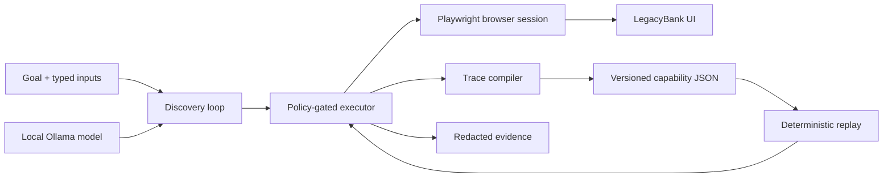

# Foundry

Foundry lets a language model discover a workflow in a real legacy-style UI, compiles the executed actions into a typed capability, and replays that capability without a model making decisions.

The included LegacyBank training surface is fictional and contains synthetic records. The main workflow finds a member, selects an account, prepares a stop-payment request, verifies the review screen, and stops before the financial commit.



The model exists only on the discovery branch. Replay loads capability JSON and calls the deterministic executor directly.

## What is implemented

- A bounded observe → decide → act loop using a local Ollama model, structured responses, and a 30-second request timeout.
- A Playwright surface adapter that operates the rendered UI inside a frame.
- Versioned JSON capabilities whose input/output schemas, generic value formats, effects, targets, handlers, checkpoints, lifecycle, and provenance are validated as one authoritative contract.
- Two model-discovered capabilities, one of which was discovered from a contract that pre-authors no route at all.
- A `draft` → `approved` lifecycle: discovery always emits a draft, and unattended replay refuses one.
- A deterministic replay interpreter whose dependency graph has no model adapter.
- Explicit business outcomes, bounded recoverable conditions, and hard failures.
- An external policy gate that checks origins, blocked routes, operations, the actual resolved control and destination, and a session-wide action budget that persists across recovery.
- Redacted JSONL evidence, semantic UI snapshots, and masked screenshots on failures.
- One-attempt automatic recovery for known interstitials, followed by escalation when recovery fails.
- Per-step read/reversible/irreversible effects, explicit approval for irreversible actions, same-session handoff, ownership epochs, and engine-validated resume.
- Restrictive tenant bindings, demonstrated by running the same artifact against Cedar and Harbor branded variants.
- Tests for parameterized replay, business outcomes, state reclassification, output corruption, policy denial, redaction, ownership races, handoff, tenant reuse, the approval gate, and compilation of a route the engineer never pre-authored.

The generated IDs and table-based markup in LegacyBank are intentional. Replay locates controls through stable user-facing relationships such as a caption's table row and an account suffix, never those IDs.

## Requirements

- Node.js 20.12 or newer
- npm
- Chromium installed through Playwright
- Ollama only for discovery; replay does not require it

No paid service is required. The first `npm ci`, browser install, Ollama install, and model pull require downloads.

## Setup

```bash
npm ci
npx playwright install chromium
```

Install [Ollama](https://ollama.com/download/mac) and pull a local model:

```bash
OLLAMA_NO_CLOUD=1 ollama serve
ollama pull qwen3:4b
```

Run the target in a separate terminal:

```bash
npm run target
```

It listens only on `127.0.0.1:3000` and prints the local training URL.

## Demo path

### 1. Discover a capability with a real model

With LegacyBank and Ollama running:

```bash
OLLAMA_NO_CLOUD=1 npm run discover -- \
  --goal "Prepare a stop-payment review using the supplied inputs, and stop on the review screen that shows every requested detail with a status of Ready for review" \
  --target http://127.0.0.1:3000/servicing \
  --inputs examples/stop-payment-success.json \
  --out capabilities/prepare-stop-payment.discovered.json \
  --model qwen3:4b
```

`--inputs` is required; everything else has a default. `--contract` selects the engineer-authored contract (`capabilities/prepare-stop-payment.example.json`), and the goal, entry URL, and output path are derived from it and from the policy's first allowed origin. Workflow-specific wording belongs in `--goal`, not in the model prompt, which names no screen, control, or domain.

The engineer-authored contract defines the typed inputs and how each renders in a UI, the outputs, the known outcomes, and the success predicate. It does not define the route. The model may drive any control the policy gate left in the observation, including controls no contract step mentions; what it cannot do is name a control that is not in the current observation, or write a literal value instead of naming a declared input. Nothing is saved unless the engineer-authored success predicate passes when checked independently of the model, so a wrong path produces no capability rather than a bad one.

Where a discovered control does match a pre-authored step, that step's effect and checkpoints annotate it. Where it does not, the compiled step carries the checkpoints the run actually observed and a conservative `reversible` effect, and the provenance note reports how many steps fell into each group so a reviewer knows what to check before approving.

The committed artifact is the direct output of the reviewed Qwen run linked below: its `provenance.discoveryRunId` and model are checked against the reviewed discovery manifest by `npm run check:evidence`, so the artifact and the run cannot drift apart.

Qwen3 4B was chosen because it runs locally at zero service cost, keeps regulated-style synthetic inputs on the machine, and is easy to reproduce. The model sees a pre-filtered list of policy-allowed actions rather than the whole browser as an unconstrained tool. That narrow action space is both what lets a small model succeed and the safety boundary: the prompt names no forbidden control, because forbidden controls never reach the model. `Submit stop payment` is removed from the observation by the policy gate and is not resolvable by the executor, so the guardrail holds whatever the model asks for.

### 2. Discover a second capability that has no pre-authored route

The stop-payment contract pre-authors the whole route, so its discovered artifact reports that every step matched a known control. To show discovery is not retracing a map, the second contract declares **meaning only** — typed inputs and outputs, known outcomes, and the success predicate — and pre-authors no UI step beyond the entry navigation.

```bash
OLLAMA_NO_CLOUD=1 npm run discover -- \
  --contract capabilities/lookup-member-account.example.json \
  --goal "Find the member with the supplied member number and stop on the member detail screen that lists their deposit accounts" \
  --inputs examples/member-lookup-success.json \
  --out capabilities/lookup-member-account.discovered.json \
  --model qwen3:4b
```

The committed result reports what that implies:

> 0 of 2 discovered steps matched a pre-authored control and inherited its effect and checkpoints; the remaining 2 carry observed checkpoints and a conservative reversible effect pending review.

Both UI steps, both targets, and both checkpoints came from the model's run. Because nothing declared what those steps do, the artifact is written as a **draft**.

### 3. Stop Ollama and replay with different inputs

```bash
npm run replay -- \
  --artifact capabilities/prepare-stop-payment.discovered.json \
  --inputs examples/stop-payment-replay.json
```

The result includes UI-extracted values and the evidence run ID. The reviewed proof used check `9021`, amount `$87.42`, and reason `stolen` after Ollama was stopped. Its [replay manifest](./evidence/reviewed/replay/manifest.json) reports `modelRequests: 0`.

### 4. Exercise a known business outcome

```bash
npm run demo:not-found
```

This returns `MEMBER_NOT_FOUND` as a typed business result rather than a crash.

### 5. Replay the same artifact for another tenant

Start the target as the Harbor variant:

```bash
LEGACYBANK_TENANT=harbor npm run target
```

Then replay through its reviewed binding:

```bash
npm run replay -- \
  --artifact capabilities/prepare-stop-payment.discovered.json \
  --inputs examples/stop-payment-replay.json \
  --binding config/tenants/harbor.json
```

The binding can select an allowed origin, entry path, and frame title. It is checked against the artifact vendor and version and cannot add code or relax policy.

### 6. Exercise same-session human handoff

Stop the normal target, then launch the expiry scenario:

```bash
LEGACYBANK_SCENARIO=session-expired npm run target
```

In another terminal:

```bash
npm run demo:handoff
```

When replay pauses, the terminal prints the exact checkpoint required for that intervention. For session expiry, click **Restore synthetic session** in the existing browser window and press Enter only after Member search appears. An unexpected-state intervention may instead require Member detail or another step-specific checkpoint. The runner validates the supplied predicate, issues a new automation ownership epoch, and safely restarts or continues the non-mutating review workflow in the same browser session.

## Other fault scenarios

Set `LEGACYBANK_SCENARIO` before starting the target:

| Scenario                         | Expected behavior                                                 |
| -------------------------------- | ----------------------------------------------------------------- |
| `normal`                         | Verified success or typed not-found outcome                       |
| `slow`                           | Bounded condition waiting; no fixed sleep-dependent flow          |
| `app-error`                      | `APP_ERROR` failure with sanitized evidence                       |
| `session-expired`                | Intervention and same-session handoff                             |
| `session-expired-before-account` | `SESSION_EXPIRED`; never misclassified as `ACCOUNT_NOT_FOUND`     |
| `unexpected-state`               | Same-session human repair followed by engine-validated resume     |
| `known-interstitial`             | One automatic dismiss action, then deterministic replay continues |
| `stubborn-interstitial`          | One recovery attempt, then `UNEXPECTED_STATE` escalation          |
| `timeout`                        | `TIMEOUT` with a sanitized snapshot and masked screenshot         |

Set `LEGACYBANK_CORRUPT_REVIEW_FIELD` to `memberId`, `accountSuffix`, `checkNumber`, `amountMinor`, or `reason` to prove that any corrupted final field prevents success.

## Validation

```bash
npm run typecheck
npm test
npm run check:evidence
npm audit
```

`npm test` runs 37 contract and browser-level acceptance tests against isolated local target servers and real headless Chromium instances. It does not invoke a model. Fault and handoff evidence is produced by this deterministic harness with scripted operator callbacks; `npm run demo:handoff` is the separate manual path. The reviewed [discovery](./evidence/reviewed/discovery/manifest.json), [model-free replay](./evidence/reviewed/replay/manifest.json), [second-capability discovery](./evidence/reviewed/lookup/discovery/manifest.json), and scenario runs are committed under `evidence/reviewed/`. [`evidence/README.md`](./evidence/README.md) indexes every run and what it proves.

List the callable capabilities as agent-facing function definitions:

```bash
npm run catalog
```

The catalog derives parameter and result schemas from each validated artifact, so an agent can discover a capability without importing its UI implementation. It lists both capabilities and marks the draft one `callable: false`.

## Capability lifecycle

Every capability carries a `lifecycle` of `draft` or `approved`.

Discovery always writes `draft`. That is not a formality: a step that matched no pre-authored control has an _inferred_ effect, recorded conservatively as `reversible` because nothing declared otherwise. An inference is not a safety property, so an unreviewed artifact is not something an agent should fire unattended at a banking UI.

`replayCapability` refuses a draft before it takes any action, and the refusal is a typed result rather than a crash:

```bash
npm run replay -- \
  --artifact capabilities/lookup-member-account.discovered.json \
  --inputs examples/member-lookup-replay.json
```

```json
{
  "status": "failed",
  "code": "CAPABILITY_NOT_APPROVED",
  "observed": "Capability lookup_member_account@1.0.0-discovered is draft"
}
```

Attended review passes `--allow-draft` (or `allowDraft` in the engine options) to run it anyway:

```bash
npm run replay -- \
  --artifact capabilities/lookup-member-account.discovered.json \
  --inputs examples/member-lookup-replay.json \
  --allow-draft
```

Promotion is a deliberate human act, and today it is a manual one: a reviewer reads the provenance note, confirms the effect and checkpoints of each unannotated step, and edits `lifecycle` to `approved`. That is the only field a reviewer changes, and re-running discovery resets it to `draft`. `npm run catalog` reports `lifecycle` and `callable` per capability, so the agent-facing surface shows a draft as not production-callable.

The committed lookup capability is deliberately left as a `draft` so the gate is visible in the repository, and `lookup-member-account.example.json` is a draft too — it declares no route, so it is a contract to discover from, not something callable. `prepare-stop-payment.discovered.json` is `approved`: its provenance records that all seven steps matched pre-authored controls, so no step carried an inferred effect for a reviewer to resolve. Its example contract stays `approved` because it is a complete, engineer-authored artifact used as a test fixture.

Replay manifests record `lifecycle` and `attended`, so a run of a draft carries the reason it was permitted.

What is missing is the workflow around that state — a reviewer UI, a recorded approver identity, and a per-step sign-off rather than one field. The schema already carries the version, effects, and provenance split such a gate would read.

## Artifact contract

The authoritative format is JSON validated by Zod. It contains four kinds of information:

1. Callable contract: identity, version, typed inputs and their UI display formats, typed outputs, and compatibility.
2. UI program: targets, ordered actions, effect annotations, preconditions, postconditions, and bounded timeouts.
3. Runtime semantics: business outcomes, bounded recoveries, hard failures, approvals, and the final success predicate.
4. Governance: lifecycle state, policy profile, and provenance linking discovered steps to a real run.

Artifacts contain parameter references such as `memberId`, not invocation values. They cannot embed JavaScript, selectors supplied by a model, network requests, shell commands, or permission grants.

The `*.example.json` contracts are engineer-authored and labeled accordingly; neither is passed off as model-generated evidence. `prepare-stop-payment.example.json` pre-authors a full route and doubles as a test fixture. `lookup-member-account.example.json` pre-authors none, which is what makes its discovered counterpart evidence that the model found the route.

## Safety model

The review workflow cannot submit a stop payment. Policy checks happen outside the model and are applied in discovery and replay. Every navigation is checked by parsed origin and path; document, XHR, fetch, script, and stylesheet requests are intercepted. The resolved element's accessible identity and its anchor or form destination are checked immediately before action, and `/workspace/submit` is independently blocked. Unknown targets and ambiguous matches stop rather than selecting the first match.

Inputs remain in memory. Evidence redacts sensitive fields and synthetic canary values before writing. Failures include screenshots whose form fields and table values are masked by Playwright. Raw browser storage, cookies, unrestricted traces, raw model prompts, and unmasked screenshots are not persisted.

These are application controls for a cooperative local demonstration. They are not a hostile-code sandbox or a claim of financial compliance. See [REPORT.md](./REPORT.md) for boundaries and production extensions.

## Repository map

```text
src/contracts/     capability and result types
src/discovery/     Ollama adapter and trace compiler
src/runtime/       replay and ownership state machine
src/safety/        allowlist and redaction
src/surfaces/      Playwright adapter
target/            synthetic LegacyBank UI
capabilities/      engineer-authored contracts and discovered artifacts
examples/          synthetic invocation inputs
evidence/          reviewed run evidence
tests/             contract and browser-level acceptance tests
```

The concise submission design and tradeoffs are in [REPORT.md](./REPORT.md).
