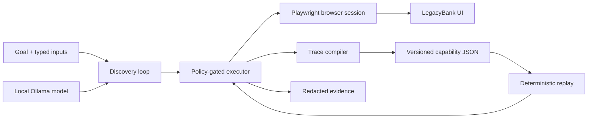

# Foundry

Foundry lets a language model discover a workflow in a real legacy-style UI, compiles the executed actions into a typed capability, and replays that capability without a model making decisions.

The included LegacyBank training surface is fictional and contains synthetic records. The main workflow finds a member, selects an account, prepares a stop-payment request, verifies the review screen, and stops before the financial commit.



The model exists only on the discovery branch. Replay loads capability JSON and calls the deterministic executor directly.

## What is implemented

- A bounded observe → decide → act loop using a local Ollama model, structured responses, and a 30-second request timeout.
- A Playwright surface adapter that operates the rendered UI inside a frame.
- Versioned JSON capabilities whose input/output schemas, generic value formats, effects, targets, handlers, checkpoints, and provenance are validated as one authoritative contract.
- A deterministic replay interpreter whose dependency graph has no model adapter.
- Explicit business outcomes, bounded recoverable conditions, and hard failures.
- An external policy gate that checks origins, blocked routes, operations, the actual resolved control and destination, and a session-wide action budget that persists across recovery.
- Redacted JSONL evidence, semantic UI snapshots, and masked screenshots on failures.
- One-attempt automatic recovery for known interstitials, followed by escalation when recovery fails.
- Per-step read/reversible/irreversible effects, explicit approval for irreversible actions, same-session handoff, ownership epochs, and engine-validated resume.
- Restrictive tenant bindings, demonstrated by running the same artifact against Cedar and Harbor branded variants.
- Tests for parameterized replay, business outcomes, state reclassification, output corruption, policy denial, redaction, ownership races, handoff, and tenant reuse.

The generated IDs and table-based markup in LegacyBank are intentional. Replay locates controls through stable user-facing relationships such as a caption's table row and an account suffix, never those IDs.

## Requirements

- Node.js 20.12 or newer
- npm
- Chromium installed through Playwright
- Ollama only for discovery; replay does not require it

No paid service is required. The first `npm ci`, browser install, Ollama install, and model pull require downloads.

## Setup

```bash
npm ci
npx playwright install chromium
```

Install [Ollama](https://ollama.com/download/mac) and pull a local model:

```bash
OLLAMA_NO_CLOUD=1 ollama serve
ollama pull qwen3:4b
```

Run the target in a separate terminal:

```bash
npm run target
```

It listens only on `127.0.0.1:3000` and prints the local training URL.

## Demo path

### 1. Discover a capability with a real model

With LegacyBank and Ollama running:

```bash
OLLAMA_NO_CLOUD=1 npm run discover -- \
  --goal "Prepare a stop-payment review using the supplied inputs and stop before submitting" \
  --target http://127.0.0.1:3000/servicing \
  --inputs examples/stop-payment-success.json \
  --out capabilities/prepare-stop-payment.discovered.json \
  --model qwen3:4b
```

The engineer-authored artifact contract defines inputs, outputs, effects, known outcomes, and the success predicate. The model discovers only the UI path. Its allowed input references are generated from that contract, and each chosen control is matched back to a contract target before execution. The saved artifact labels contract knowledge separately from the executed trace.

The linked reviewed trace is a genuine Qwen run. The committed artifact preserves that executed path; its provenance note records the later contract-only migration to generic formats, effects, and recovery semantics, which did not rerun the model.

Qwen3 4B was chosen because it runs locally at zero service cost, keeps regulated-style synthetic inputs on the machine, and is easy to reproduce. The model sees a pre-filtered list of policy-allowed actions rather than the whole browser as an unconstrained tool. That narrow action space is both what lets a small model succeed and a safety boundary.

### 2. Stop Ollama and replay with different inputs

```bash
npm run replay -- \
  --artifact capabilities/prepare-stop-payment.discovered.json \
  --inputs examples/stop-payment-replay.json
```

The result includes UI-extracted values and the evidence run ID. The reviewed proof used check `9021`, amount `$87.42`, and reason `stolen` after Ollama was stopped. Its [replay manifest](./evidence/reviewed/replay/manifest.json) reports `modelRequests: 0`.

### 3. Exercise a known business outcome

```bash
npm run demo:not-found
```

This returns `MEMBER_NOT_FOUND` as a typed business result rather than a crash.

### 4. Replay the same artifact for another tenant

Start the target as the Harbor variant:

```bash
LEGACYBANK_TENANT=harbor npm run target
```

Then replay through its reviewed binding:

```bash
npm run replay -- \
  --artifact capabilities/prepare-stop-payment.discovered.json \
  --inputs examples/stop-payment-replay.json \
  --binding config/tenants/harbor.json
```

The binding can select an allowed origin, entry path, and frame title. It is checked against the artifact vendor and version and cannot add code or relax policy.

### 5. Exercise same-session human handoff

Stop the normal target, then launch the expiry scenario:

```bash
LEGACYBANK_SCENARIO=session-expired npm run target
```

In another terminal:

```bash
npm run demo:handoff
```

When replay pauses, the terminal prints the exact checkpoint required for that intervention. For session expiry, click **Restore synthetic session** in the existing browser window and press Enter only after Member search appears. An unexpected-state intervention may instead require Member detail or another step-specific checkpoint. The runner validates the supplied predicate, issues a new automation ownership epoch, and safely restarts or continues the non-mutating review workflow in the same browser session.

## Other fault scenarios

Set `LEGACYBANK_SCENARIO` before starting the target:

| Scenario                         | Expected behavior                                                 |
| -------------------------------- | ----------------------------------------------------------------- |
| `normal`                         | Verified success or typed not-found outcome                       |
| `slow`                           | Bounded condition waiting; no fixed sleep-dependent flow          |
| `app-error`                      | `APP_ERROR` failure with sanitized evidence                       |
| `session-expired`                | Intervention and same-session handoff                             |
| `session-expired-before-account` | `SESSION_EXPIRED`; never misclassified as `ACCOUNT_NOT_FOUND`     |
| `unexpected-state`               | Same-session human repair followed by engine-validated resume     |
| `known-interstitial`             | One automatic dismiss action, then deterministic replay continues |
| `stubborn-interstitial`          | One recovery attempt, then `UNEXPECTED_STATE` escalation          |
| `timeout`                        | `TIMEOUT` with a sanitized snapshot and masked screenshot         |

Set `LEGACYBANK_CORRUPT_REVIEW_FIELD` to `memberId`, `accountSuffix`, `checkNumber`, `amountMinor`, or `reason` to prove that any corrupted final field prevents success.

## Validation

```bash
npm run typecheck
npm test
npm run check:evidence
npm audit
```

`npm test` runs 31 contract and browser-level acceptance tests against isolated local target servers and real headless Chromium instances. It does not invoke a model. Fault and handoff evidence is produced by this deterministic harness with scripted operator callbacks; `npm run demo:handoff` is the separate manual path. The reviewed [discovery](./evidence/reviewed/discovery/manifest.json), [model-free replay](./evidence/reviewed/replay/manifest.json), and scenario runs are committed under `evidence/reviewed/`.

List the callable capabilities as agent-facing function definitions:

```bash
npm run catalog
```

The catalog derives parameter and result schemas from each validated artifact, so an agent can discover a capability without importing its UI implementation.

## Artifact contract

The authoritative format is JSON validated by Zod. It contains four kinds of information:

1. Callable contract: identity, version, typed inputs, typed outputs, and compatibility.
2. UI program: targets, ordered actions, effect annotations, preconditions, postconditions, and bounded timeouts.
3. Runtime semantics: business outcomes, bounded recoveries, hard failures, approvals, and the final success predicate.
4. Governance: policy profile and provenance linking discovered steps to a real run.

Artifacts contain parameter references such as `memberId`, not invocation values. They cannot embed JavaScript, selectors supplied by a model, network requests, shell commands, or permission grants.

`capabilities/prepare-stop-payment.example.json` is an engineer-authored bootstrap artifact used for tests and is labeled accordingly. It is not passed off as model-generated evidence.

## Safety model

The review workflow cannot submit a stop payment. Policy checks happen outside the model and are applied in discovery and replay. Every navigation is checked by parsed origin and path; document, XHR, fetch, script, and stylesheet requests are intercepted. The resolved element's accessible identity and its anchor or form destination are checked immediately before action, and `/workspace/submit` is independently blocked. Unknown targets and ambiguous matches stop rather than selecting the first match.

Inputs remain in memory. Evidence redacts sensitive fields and synthetic canary values before writing. Failures include screenshots whose form fields and table values are masked by Playwright. Raw browser storage, cookies, unrestricted traces, raw model prompts, and unmasked screenshots are not persisted.

These are application controls for a cooperative local demonstration. They are not a hostile-code sandbox or a claim of financial compliance. See [REPORT.md](./REPORT.md) for boundaries and production extensions.

## Repository map

```text
src/contracts/     capability and result types
src/discovery/     Ollama adapter and trace compiler
src/runtime/       replay and ownership state machine
src/safety/        allowlist and redaction
src/surfaces/      Playwright adapter
target/            synthetic LegacyBank UI
capabilities/      bootstrap and discovered artifacts
examples/          synthetic invocation inputs
evidence/          reviewed run evidence
tests/             contract and browser-level acceptance tests
```

The concise submission design and tradeoffs are in [REPORT.md](./REPORT.md).
